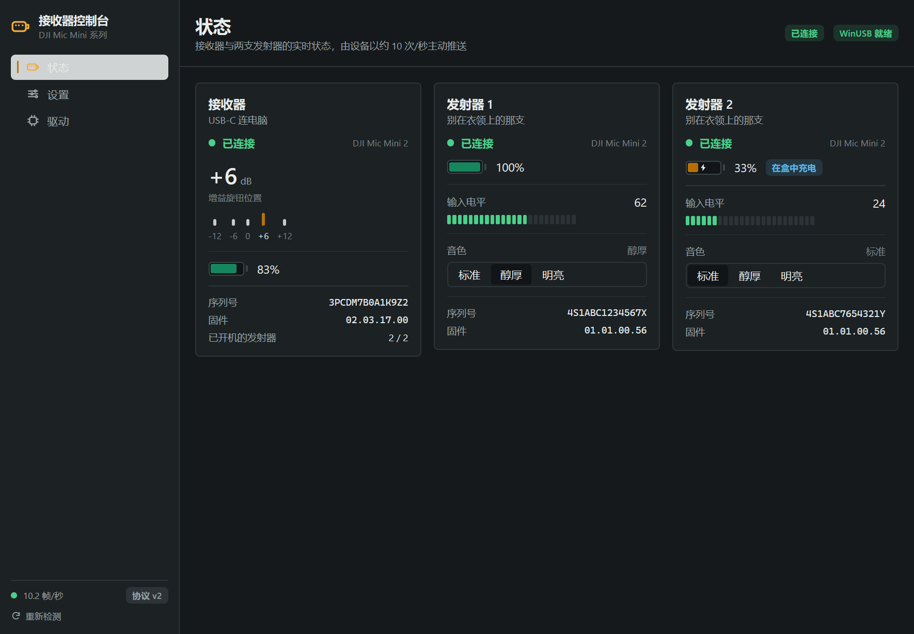
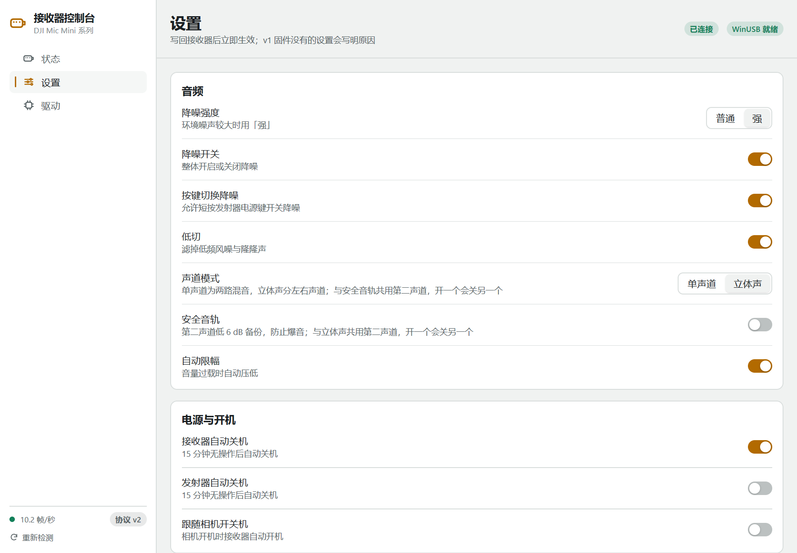

# DJI Mic 接收器控制台

用于 Windows 的 DJI Mic 接收器控制工具，支持 DMMR01 标准版与 DMMR02 手机版。

非官方工具，与 DJI 没有关系。

## 功能

- 查看连接状态、电量、实时输入电平、增益与设备信息。
- 调整降噪、低切、声道模式、安全音轨、自动关机等设置。
- 安装与卸载控制接口驱动，不影响系统录音功能。
- 原生界面，深色与浅色主题跟随系统，设备插拔后自动重连。

## 界面预览

| 状态 · 深色 | 设置 · 浅色 |
| --- | --- |
|  |  |

截图使用演示数据，实际显示内容随设备型号与固件而异。

## 运行

需要 Windows 10/11；从源码运行需要 Go 1.27.1 或更高。

```bat
go run .
```

首次连接时，在「驱动」页安装驱动（需要管理员权限），完成后**重新插拔接收器**。卸载也在该页面完成。

> 自签名构建会将证书加入本机信任，卸载时移除。安装驱动请使用构建后的 exe，避免 `go run` 的临时程序无法正常提权。

## 构建

需要 Go 与 Windows SDK（含 makecat、signtool）：

```bat
scripts\build.cmd
```

产物在 `build\windows-amd64\`：exe、NSIS 安装包，以及自动更新文件。驱动包默认用自签名证书签名。

### 发布与自动更新

应用启动时检查更新（侧栏底部显示当前版本与更新状态），更新包用 ed25519 密钥签名，公钥内置在 `mygo.json`。发布流程：

1. 把 `mygo.json` 的 `version` 改成新版本号，提交。
2. `git tag vX.Y.Z && git push origin vX.Y.Z`（标签必须与版本一致，CI 会校验）。
3. GitHub Actions 构建 exe、安装包与更新文件，上传到草稿 Release 并自动发布；旧版本随即能发现更新。

CI 需要仓库 secret `MYGO_UPDATER_PRIVATE_KEY`（更新签名私钥，由 `go tool mygo keygen` 生成）。本地手动发布：`scripts\build.cmd -Upload`（需要 gh 登录），再到 GitHub 发布草稿。

## 注意事项

- 可用设置与电量显示取决于型号和固件；发射器电量为估算值，输入电平不是 dBFS。
- Mic Mini 2S RX 尚未经过实机验证，发射器内录功能暂不支持。

## 致谢

- [mygo](https://github.com/egoist/mygo)：原生 UI 工具包。
- [ShadowBitBasher/DJI-Mic-Control](https://github.com/ShadowBitBasher/DJI-Mic-Control)、[usokawa/dji-mic-mo](https://github.com/usokawa/dji-mic-mo)：协议参考。

## 许可证

本项目以 [MIT 许可证](LICENSE) 开源。
